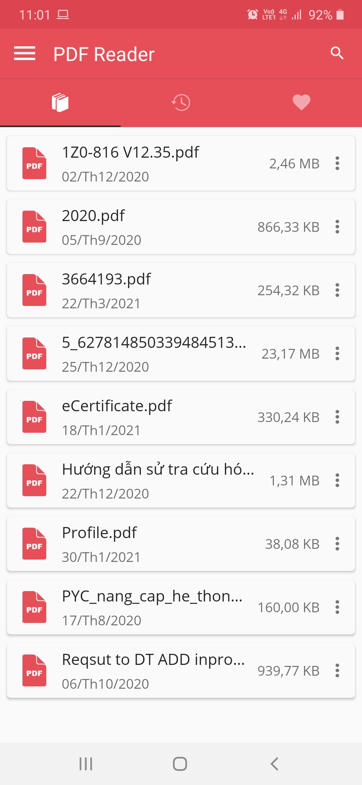
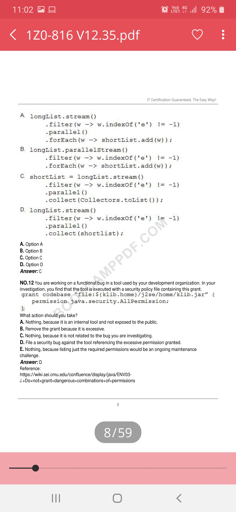
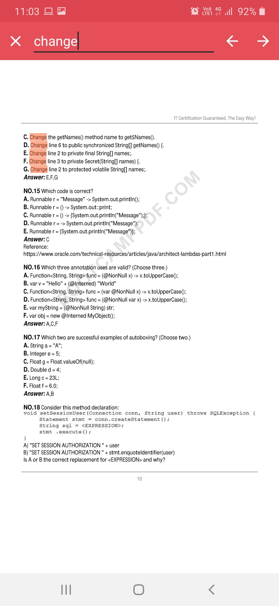
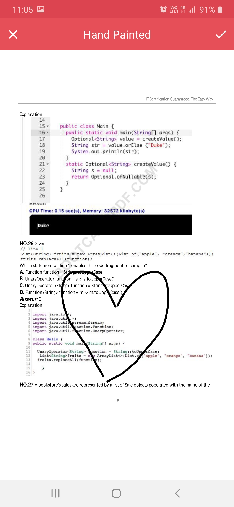

# PDF Reader

## Description
Ứng dụng hỗ trợ đọc tài liệu định dạng .pdf cùng với các tính năng: Tìm kiếm, sao chép, highlight text, ghi chú văn bản bằng tool draw trên tài liệu...

## Link app: 
[Demo](https://github.com/quangda280296/pdf_reader/blob/master/app/release/app-release.apk)

## Screenshots
![]

